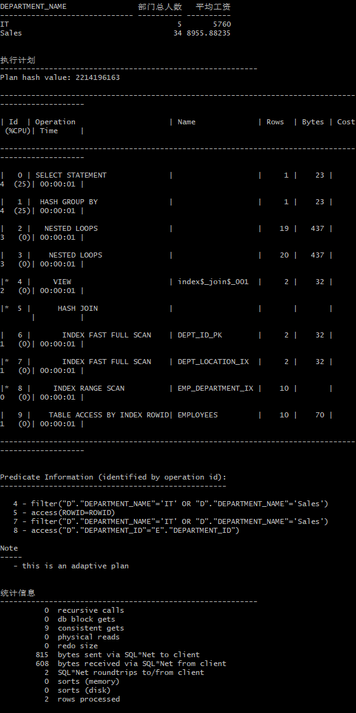
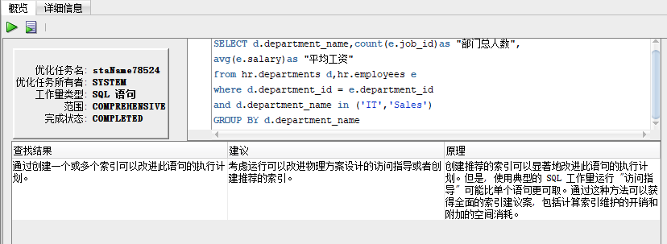
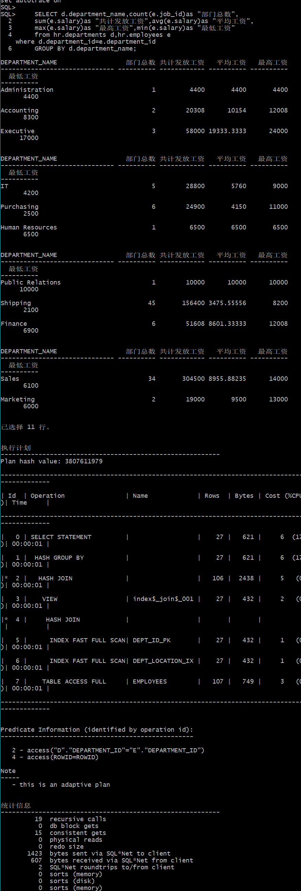
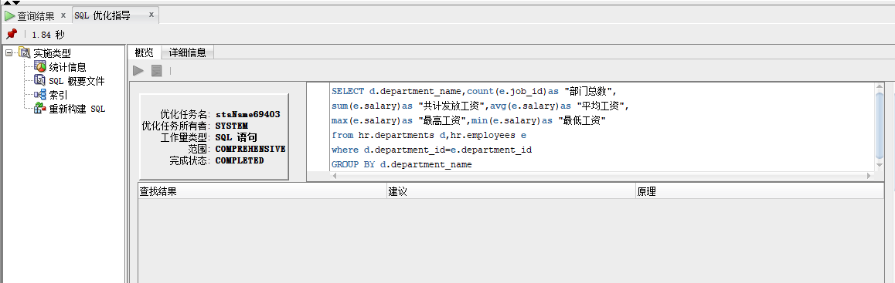

# 实验1：SQL语句的执行计划分析与优化指导

## 实验目的

分析SQL执行计划，执行SQL语句的优化指导。理解分析SQL语句的执行计划的重要作用。

## 实验内容

- 对Oracle12c中的HR人力资源管理系统中的表进行查询与分析。
- 首先运行和分析教材中的样例：本训练任务目的是查询两个部门('IT'和'Sales')的部门总人数和平均工资，以下两个查询的结果是一样的。但效率不相同。
- 设计自己的查询语句，并作相应的分析，查询语句不能太简单。
  
#### 教材中的查询语句

查询一：

    set autotrace on

    SELECT d.department_name,count(e.job_id)as "部门总人数",
    avg(e.salary)as "平均工资"
    from hr.departments d,hr.employees e
    where d.department_id = e.department_id
    and d.department_name in ('IT','Sales')
    GROUP BY d.department_name;

查询二：

    set autotrace on

    SELECT d.department_name,count(e.job_id)as "部门总人数",
    avg(e.salary)as "平均工资"
    FROM hr.departments d,hr.employees e
    WHERE d.department_id = e.department_id
    GROUP BY d.department_name
    HAVING d.department_name in ('IT','Sales');

分析：两个查询语句的physical reads都为0，即从磁盘读取的block的数量为0，表明系统中的全表扫描的SQL语句很少，数据库性能较好，其中第一个查询语句consistent gets=9，第二个查询语句consistent gets=13，这表明第一个查询语句从buffer cache中读取的undo数据的block数量比第二个少，所以第一个查询语句最优。
优化建议如下：

#### 自己的查询语句

    set autotrace on

    SELECT d.department_name,count(e.job_id)as "部门总数",
    sum(e.salary)as "共计发放工资",avg(e.salary)as "平均工资",
    max(e.salary)as "最高工资",min(e.salary)as "最低工资"
    from hr.departments d,hr.employees e
    where d.department_id=e.department_id
    GROUP BY d.department_name;
运行结果：

分析：physical reads=0，即从磁盘读取的block的数量为0，表明系统中的全表扫描的SQL语句很少，数据库性能较好，consistent gets=15，即从buffer cache中读取的undo数据的block数量为15，

优化建议：
