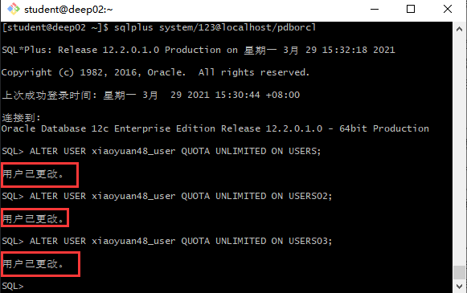
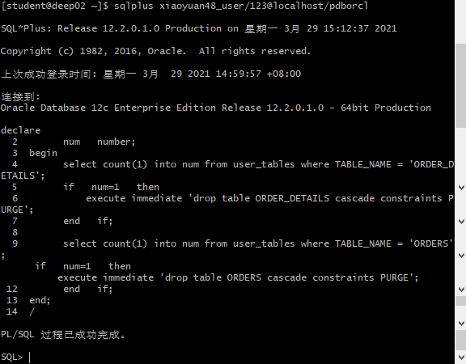
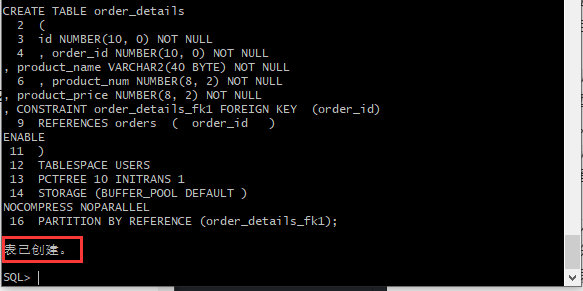
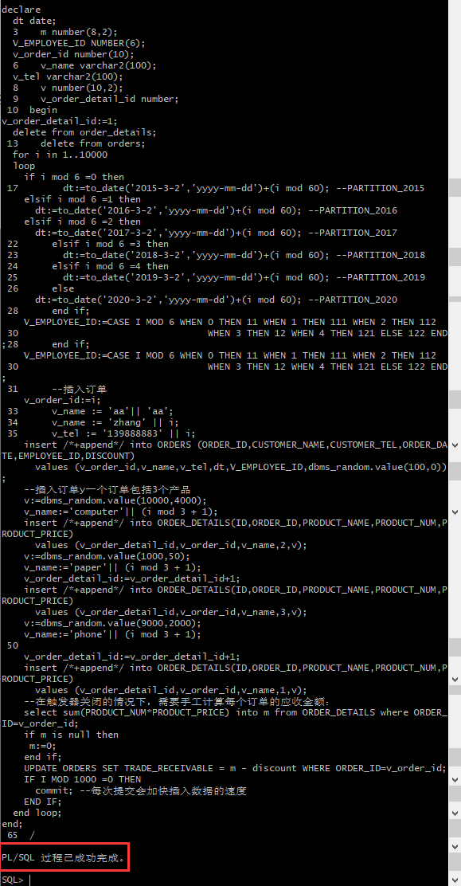
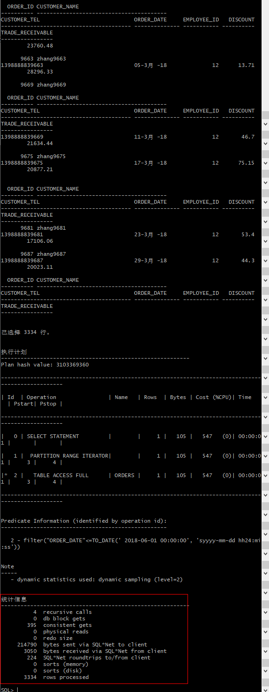
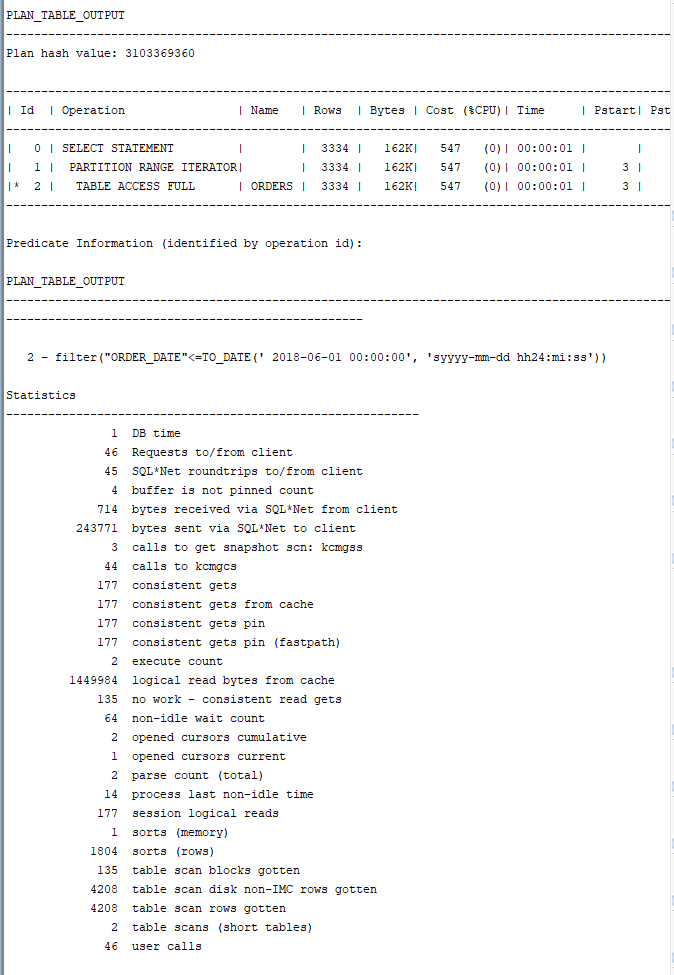
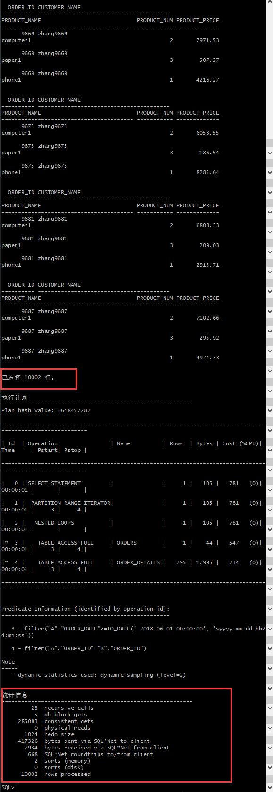
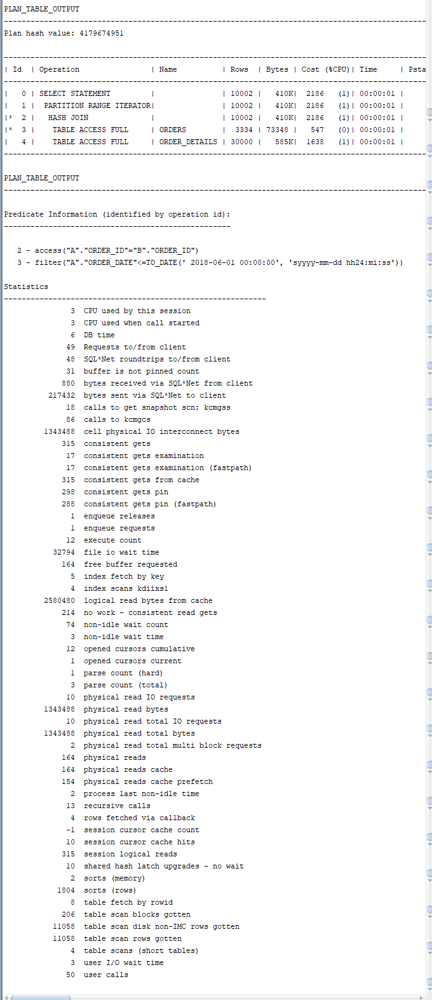

# 实验3：创建分区表

## 实验目的：

掌握分区表的创建方法，掌握各种分区方式的使用场景。

## 实验内容：

- 本实验使用3个表空间：USERS,USERS02,USERS03。在表空间中创建两张表：订单表(orders)与订单详表(order_details)。
- 使用你自己的账号创建本实验的表，表创建在上述3个分区，自定义分区策略。
- 你需要使用system用户给你自己的账号分配上述分区的使用权限。你需要使用system用户给你的用户分配可以查询执行计划的权限。
- 表创建成功后，插入数据，数据能并平均分布到各个分区。每个表的数据都应该大于1万行，对表进行联合查询。
- 写出插入数据的语句和查询数据的语句，并分析语句的执行计划。
- 进行分区与不分区的对比实验。

### 实验说明

账号为：xiaoyuan48_user

### 实验截图

授权：

在xiaoyuan48_user账号下创建了两个分区表，orders（一万行数据），order_details（三万行数据）。

PL/SQL过程：

创建order表：

创建order_details表：

插入数据：

查看插入数据的条数：

查询语句一：

查询结果一：

分析：

- recursive calls:递归调用次数。
- db block gets:从buffer cache中读取的 block的数量。
- consistent gets:从 buffer cache中读取的undo数据的block数量。
- physical reads:从磁盘读取的 block的数量。
- redo size:DML生成的redo 的大小。
- sorts (memory):在内存执行的排序量。
- sorts (disk):在磁盘上执行的排序量。

执行计划一：

查询语句二：

查询结果二:

执行计划二：

