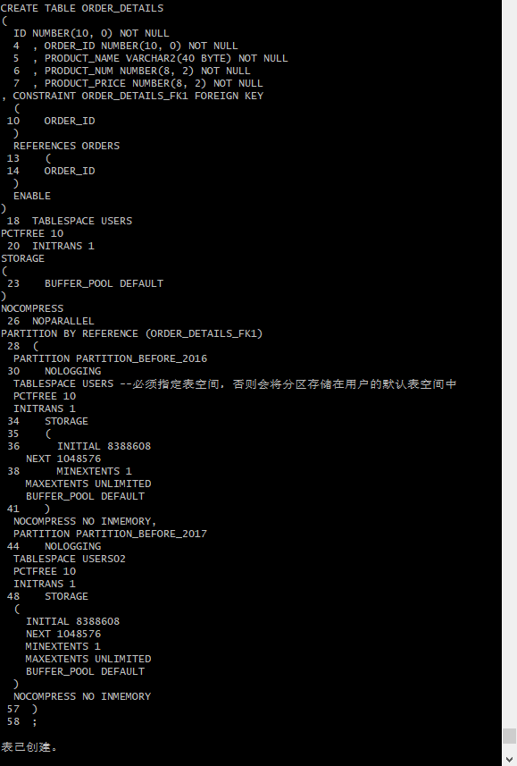
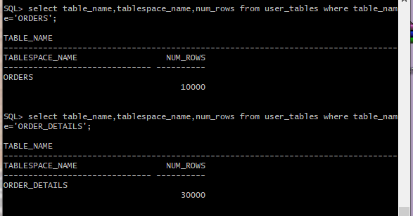

# 实验4：对象管理

## 实验目的：

了解Oracle表和视图的概念，学习使用SQL语句Create Table创建表，学习Select语句插入，修改，删除以及查询数据，学习使用SQL语句创建视图，学习部分存储过程和触发器的使用。

## 实验场景：

假设有一个生产某个产品的单位，单位接受网上订单进行产品的销售。通过实验模拟这个单位的部分信息：员工表，部门表，订单表，订单详单表。

## 实验内容：
在建表前需要对用户xiaoyuan48_user进行授权：

在xiaoyuan48_user下运行，首先删除表和序列，会一起删除主外键、触发器、程序包：

创建表DEPARTMENTS：

创建表EMPLOYEES：

创建索引，对表EMPLOYEES进行更改：

创建表PRODUCTS并对表进行更改：

创建"ORDER_ID_TEMP"，并写上注释：

创建表ORDERS：

创建本地分区索引ORDERS_INDEX_DATE,ORDERS_INDEX_CUSTOMER_NAME：

对表orders进行更改：

创建表ORDER_DETAILS：

创建索引ORDER_DETAILS_PK：

对表ORDER_DETAILS进行更改：

创建索引ORDER_DETAILS_ORDER_ID（这个索引是必须的，可以使整个订单的详单存放在一起）：

对表ORDER_DETAILS进行更改：

创建触发器ORDERS_TRIG_ROW_LEVEL：

批量插入订单数据之前，禁用触发器：

创建触发器"ORDER_DETAILS_ROW_TRIG"并在批量插入订单数据之前，禁用触发器：

创建触发器"ORDER_DETAILS_SNTNS_TRIG"并在批量插入订单数据之前，禁用触发器:

创建序列SEQ_ORDER_ID和SEQ_ORDER_DETAILS_ID：

创建视图VIEW_ORDER_DETAILS：

插入DEPARTMENTS，EMPLOYEES数据:

批量插入订单数据，注意ORDERS.TRADE_RECEIVABLE（订单应收款）的自动计算,注意插入数据的速度:

动态增加一个PARTITION_BEFORE_2018分区:

#### 查询

1.查询某个员工的信息

2.递归查询某个员工及其所有下属，子下属员工。

3.特殊查询语句
- 查询分区表情况:

- 查询分区索引情况：

4.查询一个分区中的数据。

5.收集表的统计信息dbms_stats.gather_table_stats
- 分析单个表：

- 统计用户的所有表：

6.统计完成后，查询表的统计信息：

## 表结构

- 部门表DEPARTMENTS,表空间：USERS

|编号|字段名|数据类型|可以为空|注释|
|---|---|---|---|---|
|1|DEPARTMENT_ID|NUMBER(6,0)|NO|部门ID，主键|
|2|DEPARTMENT_NAME|VARCHAR2(40 BYTE)|NO|部门名称，非空|

- 产品表PRODUCTS,表空间：USERS

|编号|字段名|数据类型|可以为空|注释|
|---|---|---|---|---|
|1|PRODUCT_NAME|VARCHAR2(40 BYTE)|NO|产品名称，产品表的主键|
|2|PRODUCT_TYPE|VARCHAR2(40 BYTE)|NO|产品类型，只能取值：耗材,手机,电脑|

- 员工表EMPLOYEES,表空间：USERS

|编号|字段名|数据类型|可以为空|注释|
|---|---|---|---|---|
|1|EMPLOYEE_ID|NUMBER(6,0)|NO|员工ID，员工表的主键。|
|2|NAME|VARCHAR2(40 BYTE)|NO|员工姓名，不能为空，创建不唯一B树索引。|
|3|EMAIL|VARCHAR2(40 BYTE)|YES|电子信箱|
|4|PHONE_NUMBER|VARCHAR2(40 BYTE)|YES|电话|
|5|HIRE_DATE|DATE|NO|雇佣日期|
|6|SALARY|NUMBER(8,2)|YES|月薪，必须>0|
|7|MANAGER_ID|NUMBER(6,0)|YES|员工的上司，是员工表EMPOLYEE_ID的外键，MANAGER_ID不能等于EMPLOYEE_ID,即员工的领导不能是自己。主键删除时MANAGER_ID设置为空值。|
|8|DEPARTMENT_ID|NUMBER(6,0)|YES|员工所在部门，是部门表DEPARTMENTS的外键|
|9|PHOTO|BLOB|YES|员工照片

- 订单表ORDERS, 表空间：分区表：USERS,USERS02

|编号|字段名|数据类型|可以为空|注释|
|---|---|---|---|---|
|1|ORDER_ID|NUMBER(10,0)|NO|订单编号，主键，值来自于序列：SEQ_ORDER_ID|
|2|CUSTOMER_NAME|VARCHAR2(40 BYTE)|NO|客户名称，B树索引|
|3|CUSTOMER_TEL|VARCHAR2(40 BYTE)|NO|客户电话|
|4|ORDER_DATE|DATE|NO|订单日期，根据该属性分区存储：2015年及以前的数据存储在USERS表空间，2016年及以后的数据存储在USERS02表空间中。|
|5|EMPLOYEE_ID|NUMBER(6,0)|NO|订单经手人，员工表EMPLOYEES的外键|
|6|DISCOUNT|Number(8,2)|YES|订单整体优惠金额。默认值为0|
|7|TRADE_RECEIVABLE|Number(8,2)|YES|订单应收货款，默认为0，Trade_Receivable= sum(订单详单表.Product_Num*订单详单表.Product_Price)- Discount|

- 订单详单表ORDER_DETAILS, 表空间：分区表：USERS,USERS02，分区参照ORDERS表。

|编号|字段名|数据类型|可以为空|注释|
|---|---|---|---|---|
|1|ID|NUMBER(10,0)|NO|本表的主键，值来自于序列：SEQ_ORDER_DETAILS_ID|
|2|ORDER_ID|NUMBER(10,0)|NO|所属的订单号，订单表ORDERS的外键|
|4|PRODUCT_NAME|VARCHAR2(40 BYTE)|NO|产品名称, 是产品表PRODUCTS的外键|
|5|PRODUCT_NUM|NUMBER(8,2)|NO|产品销售数量，必须>0|
|6|PRODUCT_PRICE|NUMBER(8,2)|NO|产品销售价格|