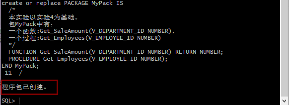
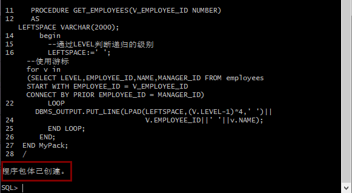
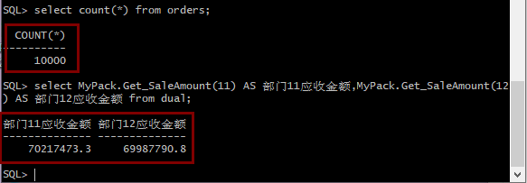
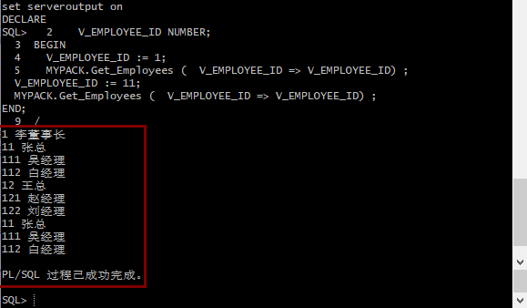
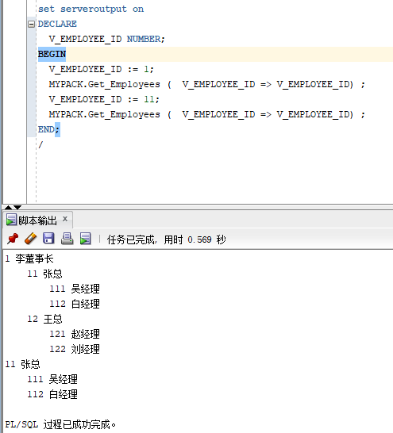

# 实验5：PL/SQL编程

## 实验目的

    了解PL/SQL语言结构
    了解PL/SQL变量和常量的声明和使用方法
    学习条件语句的使用方法
    学习分支语句的使用方法
    学习循环语句的使用方法
    学习常用的PL/SQL函数
    学习包，过程，函数的用法。

## 实验场景

- 假设有一个生产某个产品的单位，单位接受网上订单进行产品的销售。通过实验模拟这个单位的部分信息：员工表，部门表，订单表，订单详单表。
- 本实验以实验四为基础

## 实验内容

1.创建一个包(Package)，包名是MyPack。

2.在MyPack中创建一个函数SaleAmount ，查询部门表，统计每个部门的销售总金额，每个部门的销售额是由该部门的员工(ORDERS.EMPLOYEE_ID)完成的销售额之和。函数SaleAmount要求输入的参数是部门号，输出部门的销售金额。

3.在MyPack中创建一个过程，在过程中使用游标，递归查询某个员工及其所有下属，子下属员工。过程的输入参数是员工号，输出员工的ID,姓名，销售总金额。信息用dbms_output包中的put或者put_line函数。输出的员工信息用左添加空格的多少表示员工的层次（LEVEL）。比如下面显示5个员工的信息：

    ID 姓名 销售总金额
    =======================
    2  张三  5000元
    3 李四   6000元
    4 王五   1000元
     5 孙强  2000元
    6  赵强东 5000 元

### 测试

函数Get_SaleAmount()测试方法:

过程Get_Employees()测试代码：

