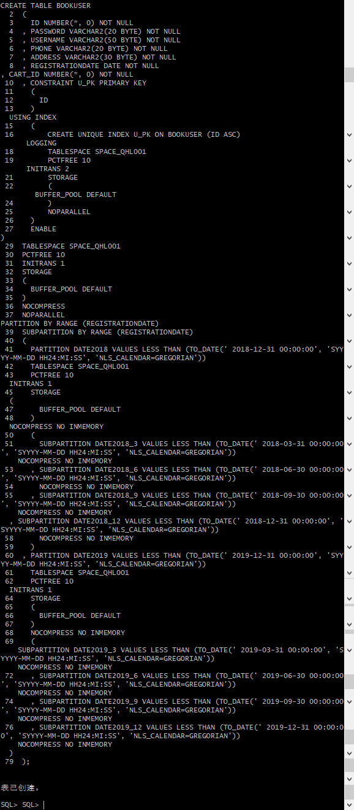
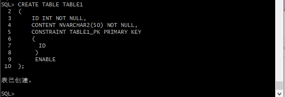
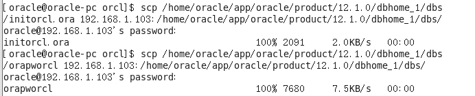

## 实验6 基于Oracle的书籍交易系统数据库设计 | [返回](./README.md)

- 期末考核要求
    - 自行设计一个信息系统的数据库项目，自拟```某项目```名称。
    - 设计项目涉及的表及表空间使用方案。至少5张表和5万条数据，两个表空间。
    - 设计权限及用户分配方案。至少两类角色，两个用户。
    - 在数据库中建立一个程序包，在包中用PL/SQL语言设计一些存储过程和函数，实现比较复杂的业务逻辑，用模拟数据进行执行计划分析。
    - 设计自动备份方案或则手工备份方案。
    - 设计容灾方案。使用两台主机，通过DataGuard实现数据库整体的异地备份。
  
### 实验内容

##### 1. 创建表空间

- space_qhl001
  
- space_qhl002
  

##### 2. 创建角色及用户

创建角色qhl1将connect,resource,create view授权给qhl1，分配60M空间给qhl_1并将角色qhl1授权给用户qhl_1。


创建角色qhl2，将connect,resource权限给qhl2,分配60M空间给qhl_2并将角色qhl2授权给用户qhl_2.


##### 3. 在用户qhl_1下创建表

- 创建管理员表
  
- 创建用户表
根据注册日期按范围分区,分为2018和2019年两个分区，每年按季度划4个子分区.
  
- 创建商品表
  
- 创建购物车表
  购物车采用引用分区
  
- 创建论坛表
  

- 创建视图计算每个用户购车中单个商品的总价
  
  

用户qhl_1空间不足，修改qhl_1空间大小


##### 4. 插入用户、商品、购物车数据


再次进行查找，查看数据是否插入成功


##### 5. 创建程序包、存储过程、函数执行分析计划

(1)创建程序包
- 函数getcartsumprice计算每个用户的购物车商品总金额
- 存储过程adduser插入用户信息


(2)创建函数、存储过程


(3)存储过程、函数执行分析
使用自定义函数getcartsumprice（）查询id号为20011的用户购物车商品总价

使用存储过程adduser插入用户数据


(4)执行计划分析


(5)表空间使用状况


##### 6.备份恢复

备份

查看备份内容


删除数据

恢复备份


数据已恢复


##### 7.容灾

主库查询确认组数

主库增加standbylogfile：

    alter database add standby logfile  group 8 '/home/oracle/app/oracle/oradata/orcl/stdredo1.log' size 50m;
    alter database add standby logfile  group 9 '/home/oracle/app/oracle/oradata/orcl/stdredo2.log' size 50m;
    alter database add standby logfile  group 10 '/home/oracle/app/oracle/oradata/orcl/stdredo3.log' size 50m;
    alter database add standby logfile  group 11 '/home/oracle/app/oracle/oradata/orcl/stdredo4.log' size 50m;
主库环境开启强制归档并修改参数

    ALTER DATABASE FORCE LOGGING;

    alter system set LOG_ARCHIVE_CONFIG='DG_CONFIG=(orcl,stdorcl)' scope=both sid='*';
    alter system set log_archive_dest_1='LOCATION=/home/oracle/arch VALID_FOR=(ALL_LOGFILES,ALL_ROLES) DB_UNIQUE_NAME=orcl' scope=spfile;
    alter system set LOG_ARCHIVE_DEST_2='SERVICE=stdorcl LGWR ASYNC  VALID_FOR=(ONLINE_LOGFILES,PRIMARY_ROLE) DB_UNIQUE_NAME=stdorcl' scope=both sid='*';
    alter system set fal_client='orcl' scope=both sid='*';    
    alter system set FAL_SERVER='stdorcl' scope=both sid='*';  
    alter system set standby_file_management=AUTO scope=both sid='*';
    alter system set DB_FILE_NAME_CONVERT='/home/oracle/app/oracle/oradata/stdorcl/','/home/oracle/app/oracle/oradata/orcl/' scope=spfile sid='*';  
    alter system set LOG_FILE_NAME_CONVERT='/home/oracle/app/oracle/oradata/stdorcl/','/home/oracle/app/oracle/oradata/orcl/' scope=spfile sid='*';
    alter system set log_archive_format='%t_%s_%r.arc' scope=spfile sid='*';
    alter system set remote_login_passwordfile='EXCLUSIVE' scope=spfile;
    alter system set PARALLEL_EXECUTION_MESSAGE_SIZE=8192 scope=spfile;

在备库oracle用户创建归档目录，数据目录并设置权限

    mkdir -p /u01/app/oracle/diag/orcl
    mkdir -p /u01/app/oracle/oradata/stdorcl/
    mkdir -p /u01/arch
    mkdir -p /u01/rman
    mkdir -p /u01/app/oracle/oradata/stdorcl/pdbseed/
    mkdir -p /u01/app/oracle/oradata/stdorcl/pdb/
备库下执行

    $sqlplus / as sysdba
    shutdown immediate;
    startup mount exclusive restrict; 
    drop database;
    startup nomount
修改主库及备库下文件/home/oracle/app/oracle/product/12.1.0/dbhome_1/network/admin/tnsnames.ora加入配置：

    ORCL =
    (DESCRIPTION =
        (ADDRESS_LIST =
        (ADDRESS = (PROTOCOL = TCP)(HOST = 192.168.1.104)(PORT = 1521))  //**
        )
        (CONNECT_DATA =
        (SERVER = DEDICATED)
        (SERVICE_NAME = orcl)
        )
    )

    stdorcl =
    (DESCRIPTION =
        (ADDRESS = (PROTOCOL = TCP)(HOST = 192.168.1.103)(PORT = 1521))  //**
        (CONNECT_DATA =
        (SERVER = DEDICATED)
        (SID = orcl)
        )
    )
在主库上生成备库的参数文件

将主库的参数文件，密码文件拷贝到备库

将主库复制到备库

    rman target sys/123@orcl auxiliary sys/123@stdorcl

    run{ 
    allocate channel c1 type disk;
    allocate channel c2 type disk;
    allocate channel c3 type disk;
    allocate AUXILIARY channel c4 type disk;
    allocate AUXILIARY channel c5 type disk;
    allocate AUXILIARY channel c6 type disk;
    DUPLICATE TARGET DATABASE
    FOR STANDBY
    FROM ACTIVE DATABASE
    DORECOVER
    NOFILENAMECHECK;
    release channel c1;
    release channel c2;
    release channel c3;
    release channel c4;
    release channel c5;
    release channel c6;
    }
在备库上更改参数文件

    gedit /home/oracle/app/oracle/product/12.1.0/dbhome_1/dbs/initorcl.ora  

    orcl.__data_transfer_cache_size=0
    orcl.__db_cache_size=671088640
    orcl.__java_pool_size=16777216
    orcl.__large_pool_size=33554432
    orcl.__oracle_base='/home/oracle/app/oracle'#ORACLE_BASE set from environment
    orcl.__pga_aggregate_target=536870912
    orcl.__sga_target=1258291200
    orcl.__shared_io_pool_size=50331648
    orcl.__shared_pool_size=301989888
    orcl.__streams_pool_size=0
    *._allow_resetlogs_corruption=TRUE
    *._catalog_foreign_restore=FALSE
    *.audit_file_dest='/home/oracle/app/oracle/admin/orcl/adump'
    *.audit_trail='db'
    *.compatible='12.1.0.2.0'
    *.control_files='/home/oracle/app/oracle/oradata/orcl/control01.ctl','/home/oracle/app/oracle/fast_recovery_area/orcl/control02.ctl','/home/oracle/app/oracle/fast_recovery_area/orcl/control03.ctl'
    *.db_block_size=8192
    *.db_domain=''
    *.db_file_name_convert='/home/oracle/app/oracle/oradata/orcl/','/home/oracle/app/oracle/oradata/stdorcl/'
    *.db_name='orcl'
    *.db_unique_name='stdorcl'
    *.db_recovery_file_dest='/home/oracle/app/oracle/fast_recovery_area'
    *.db_recovery_file_dest_size=4823449600
    *.diagnostic_dest='/home/oracle/app/oracle'
    *.dispatchers='(PROTOCOL=TCP)(dispatchers=1)(pool=on)(ticks=1)(connections=500)(sessions=1000)'
    *.enable_pluggable_database=true
    *.fal_client='stdorcl'
    *.fal_server='orcl'
    *.inmemory_max_populate_servers=2
    *.inmemory_size=157286400
    *.local_listener=''
    *.log_archive_config='DG_CONFIG=(stdorcl,orcl)'
    *.log_archive_dest_1='LOCATION=/home/oracle/arch VALID_FOR=(ALL_LOGFILES,ALL_ROLES) DB_UNIQUE_NAME=stdorcl'
    *.log_archive_dest_2='SERVICE=orcl LGWR ASYNC  VALID_FOR=(ONLINE_LOGFILES,PRIMARY_ROLE) DB_UNIQUE_NAME=orcl'
    *.log_archive_format='%t_%s_%r.arc'
    *.log_file_name_convert='/home/oracle/app/oracle/oradata/orcl/','/home/oracle/app/oracle/oradata/stdorcl/'
    *.max_dispatchers=5
    *.max_shared_servers=20
    *.open_cursors=400
    *.parallel_execution_message_size=8192
    *.pga_aggregate_target=511m
    *.processes=300
    *.recovery_parallelism=0
    *.remote_login_passwordfile='EXCLUSIVE'
    *.service_names='ORCL'
    *.sga_max_size=1572864000
    *.sga_target=1258291200
    *.shared_server_sessions=200
    *.standby_file_management='AUTO'
    *.undo_tablespace='UNDOTBS1'
在备库增加静态监听

    gedit /home/oracle/app/oracle/product/12.1.0/dbhome_1/network/admin/listener.ora //运行

    SID_LIST_LISTENER =
    (SID_LIST =
        (SID_DESC =
        (ORACLE_HOME = /home/oracle/app/oracle/product/12.1.0/db_1)
        (SID_NAME = orcl)
        )
    )
重启备库

    shudown
    startup
    alter database recover managed standby database disconnect;